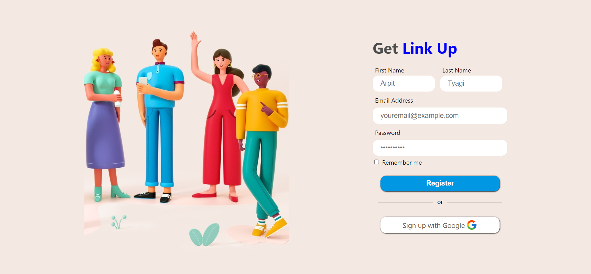

# LinkUp

LinkUp is a real-time chatting application building using the MERN (MongoDB, Express.js, React.js, Node.js) stack. It aims to allow users to connect with each other and engage in real-time conversations. With LinkUp, you can create chat rooms, send messages, and interact with other users seamlessly.



> As the project is under development, there is a lot of scope for open source contributions.

## Pages

- [Login page](https://getlinkup.vercel.app/login)
- [Signup page](https://getlinkup.vercel.app/signup)
- [Forgot password page](https://getlinkup.vercel.app/forgot)
- [Chatting page](https://getlinkup.vercel.app/chat)

## Libraries used in Frontend

- react-router-dom
- socket.io-client
- @react-oauth/google
- jsonwebtoken

## Libraries used in Backend

- express
- cors
- nodemon
- socket.io
- dotenv

## Installation and setup

To run LinkUp locally on your machine, follow these steps:

1. Clone the repository from GitHub:

```bash
git clone https://github.com/your-username/linkup.git
```

2. Install the dependencies for the server:

```bash
cd linkup-backend
npm install
```

3. Install the dependencies for the client:

```bash
cd ../linkup-frontend
npm install
```

4. Set up the environment variables:

- Create a .env file in the server directory.
- Add the required environment variables, such as database connection URL, JWT secret key, and any other configuration variables.

5. Start the development server:

- Run the server:

```bash
cd ../linkup-backent
npm start
```

- Run the client:

```bash
cd ../linkup-frontend
npm start
```

6. Access LinkUp in your web browser:

```bash
http://localhost:3000
```

## Contributing

We welcome contributions from the community to enhance LinkUp further. To contribute, please follow these steps:

1. Fork the repository.

2. Create a new branch for your feature or bug fix.

3. Commit your changes and push them to your branch.

4. Submit a pull request, clearly documenting the changes and their purpose.

We will review your pull request, provide feedback if necessary, and merge it once it meets the project's standards.

## Contact

If you have any questions, suggestions, or feedback regarding LinkUp, please feel free to contact us at arpittyagirocks@gmail.com
